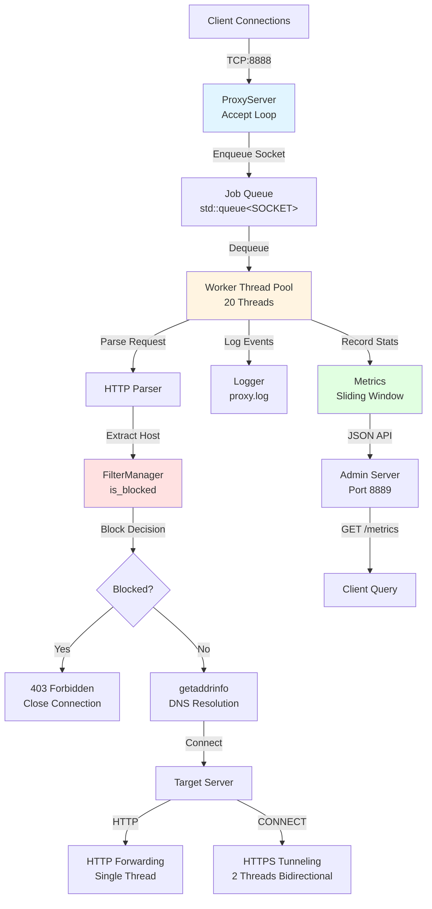

# Design Document — Custom Network Proxy Server

## High-Level Architecture

The proxy server implements a **thread pool-based forward proxy** architecture using blocking I/O with Winsock. The system is composed of five primary components that operate independently but coordinate through shared state and synchronization primitives.

### Component Overview

| Component         | Responsibility                                                 | Thread Safety                                                  |
| ----------------- | -------------------------------------------------------------- | -------------------------------------------------------------- |
| **ProxyServer**   | Main accept loop, connection queue management, request routing | Thread-safe queue with mutex/condition variable                |
| **FilterManager** | Domain/IP-based request filtering using blacklist rules        | Thread-safe via mutex-protected internal state                 |
| **Logger**        | Persistent request logging to disk                             | Thread-safe via mutex-protected file handle                    |
| **Metrics**       | Real-time statistics (RPM, top domains) with sliding window    | Lock-free atomic operations for counters, mutex for domain map |
| **Admin Server**  | Separate HTTP server on port 8889 for metrics/control API      | Single-threaded accept loop                                    |

### Architecture Diagram



### Component Interactions

**ProxyServer** acts as the orchestrator:

- Maintains the listening socket on port 8888
- Runs the main accept loop in the primary thread
- Pushes accepted client sockets to `m_jobQueue`
- Spawns 20 worker threads that consume from the queue
- Each worker thread calls `handle_client()` for dequeued sockets

**FilterManager** provides synchronous filtering:

- Loads rules from `config/blocked_domains.txt` at startup
- Supports exact matches, wildcard suffixes (`*.example.com`), and IP addresses
- `is_blocked()` is called once per request before DNS resolution
- Uses Pimpl pattern to hide internal `std::vector` storage

**Logger** writes structured log entries:

- Format: `ISO_TIMESTAMP CLIENT_IP:PORT "REQUEST_LINE" HOST:PORT ACTION STATUS BYTES`
- Thread-safe via mutex around `std::ofstream`
- Flushes after each write to ensure durability

**Metrics** tracks aggregate statistics:

- **RPM Calculation**: 60-second sliding window with atomic counters per second slot
- Background thread advances the current slot every second, zeroing the next slot
- Domain frequency tracking uses `std::unordered_map` protected by mutex
- `get_rpm()` sums all 60 atomic slots (lock-free read)
- `get_top_k()` requires mutex lock to sort domain counts

**Admin Server** runs in a detached thread:

- Listens on `127.0.0.1:8889` (loopback only)
- Handles two endpoints:
  - `GET /metrics`: Returns JSON with RPM, bandwidth limit, and top 5 domains
  - `GET /speed=N`: Updates `m_maxBytesPerSec` atomically

## Concurrency Model

The system uses a **hybrid thread pool model** combining a fixed worker pool with dynamic thread creation for bidirectional data forwarding.

### Primary Model: Fixed Thread Pool

**Rationale**: A fixed pool of 20 worker threads prevents thread exhaustion under high connection rates while maintaining predictable resource usage. This is superior to thread-per-connection for this use case because:

1. **Resource Bounds**: Maximum 20 concurrent request handlers, preventing OS thread limit exhaustion
2. **Reduced Overhead**: Thread creation/destruction cost is amortized across many requests
3. **Queue-Based Backpressure**: When all workers are busy, new connections wait in the queue rather than spawning unbounded threads

**Implementation Details**:

- Main thread runs the accept loop (`ProxyServer::start()`)
- Accepted sockets are pushed to `m_jobQueue` (protected by `m_queueMutex`)
- 20 worker threads block on `m_condition.wait()` until a socket is available
- Each worker calls `handle_client()` synchronously, blocking for the entire request lifecycle

**Trade-offs**:

| Aspect                    | Thread Pool (Current)             | Thread-per-Connection           | Event Loop (IOCP/epoll)      |
| ------------------------- | --------------------------------- | ------------------------------- | ---------------------------- |
| **Scalability**           | Limited to 20 concurrent requests | Unlimited (until OS limit)      | Very high (10K+ connections) |
| **Latency**               | Low (no thread creation overhead) | Higher (thread creation cost)   | Lowest (no blocking)         |
| **Complexity**            | Medium (queue management)         | Low (simple spawn)              | High (async state machines)  |
| **Resource Usage**        | Predictable (fixed memory)        | Unpredictable (grows with load) | Very efficient (low memory)  |
| **Blocking I/O**          | Compatible                        | Compatible                      | Requires async I/O           |
| **Winsock Compatibility** | Native                            | Native                          | Requires IOCP (complex)      |

**Why Not Event Loop?**: While IOCP (Windows I/O Completion Ports) would provide superior scalability, it requires:

- Complete rewrite to asynchronous I/O
- Complex state machine management for partial reads/writes
- More complex error handling
- The current blocking model is sufficient for moderate traffic (hundreds of requests/second) and significantly simpler to maintain.

### Secondary Model: Dynamic Threads for Tunneling

For HTTPS `CONNECT` requests, the system creates **2 additional threads per connection** for bidirectional forwarding:

```cpp
run_tunnel(clientSocket, serverSock, limit) {
    thread t1: forward_loop(client -> server)  // Client-to-server data
    thread t2: forward_loop(server -> client)  // Server-to-client data
    join both threads
    graceful_close()
}
```

**Rationale**: Each `forward_loop()` blocks on `recv()`, so bidirectional forwarding requires two threads. This is necessary because:

- The proxy cannot know which direction will have data first
- Blocking on one direction would deadlock the other
- This pattern is standard for TCP tunneling

**Resource Impact**: Under full HTTPS load, the system can have:

- 20 worker threads (from pool)
- Up to 20 × 2 = 40 additional forwarding threads (if all 20 workers handle CONNECT simultaneously)
- Total: ~60 threads maximum

This is acceptable for Windows (typical limit: 2000+ threads per process) but represents a known scalability constraint.

### Synchronization Primitives

| Resource                 | Protection Mechanism                     | Rationale                                                                             |
| ------------------------ | ---------------------------------------- | ------------------------------------------------------------------------------------- |
| `m_jobQueue`             | `std::mutex` + `std::condition_variable` | Producer-consumer pattern: main thread enqueues, workers dequeue                      |
| `FilterManager::pimpl`   | `std::mutex` in Impl                     | Read operations (rule matching) are frequent; mutex prevents race on vector iteration |
| `Logger::pimpl->ofs`     | `std::mutex`                             | File I/O is not thread-safe; serialization ensures log integrity                      |
| `Metrics::slots[]`       | `std::atomic<uint64_t>`                  | Lock-free increments for RPM tracking (high-frequency operation)                      |
| `Metrics::domain_counts` | `std::mutex`                             | Hash map updates require full lock (less frequent than slot increments)               |
| `m_maxBytesPerSec`       | `std::atomic<size_t>`                    | Admin server updates bandwidth limit without blocking workers                         |

## Data Flow

### Request Lifecycle

#### Phase 1: Connection Acceptance

1. **Main Thread** (`ProxyServer::start()`):
   - Calls `accept(m_listenSocket)` — blocks until a client connects
   - Extracts client IP:port via `getpeername()` (for logging)
   - Locks `m_queueMutex`, pushes socket to `m_jobQueue`
   - Calls `m_condition.notify_one()` to wake a waiting worker
   - Loops back to `accept()` (non-blocking queue operation)

#### Phase 2: Request Parsing (Worker Thread)

2. **Worker Thread** (`ProxyServer::handle_client()`):
   - Dequeues socket from `m_jobQueue` (already holding lock)
   - Sets `SO_RCVTIMEO` to 10 seconds on client socket
   - Reads HTTP request headers in a loop until `\r\n\r\n` delimiter found:
     - Maximum request size: 65536 bytes (hard limit to prevent memory exhaustion)
     - On timeout or error: closes socket and returns
   - Parses request line: `METHOD TARGET VERSION`
   - Parses headers into `std::map<std::string, std::string>` (lowercased keys)

#### Phase 3: Host Extraction

3. **Host Resolution Logic**:
   - **CONNECT method**: Extracts host:port from `TARGET` (e.g., `example.com:443`)
   - **HTTP methods**: Extracts host from `Host:` header, defaults port to 80
   - If host is empty → logs 400 error, closes connection

#### Phase 4: Filtering

4. **FilterManager::is_blocked(host)**:
   - Converts host to lowercase
   - Locks internal mutex
   - Checks exact match against `pimpl->exact` vector
   - Checks suffix match against `pimpl->suffix` vector (for `*.example.com` patterns)
   - Returns `true` if blocked
   - **If blocked**: Sends `HTTP/1.1 403 Forbidden`, logs action, closes connection

#### Phase 5: DNS Resolution

5. **Target Server Connection**:
   - Calls `getaddrinfo(host, port)` — **blocking DNS lookup**
   - If DNS fails → logs 502 error, closes connection
   - Creates socket using resolved address family (IPv4/IPv6)
   - Sets `SO_RCVTIMEO` to 10 seconds on server socket
   - Calls `connect(serverSock)` — **blocking connection**
   - If connect fails → logs 502 error, closes both sockets

#### Phase 6: Request Forwarding

**Path A: HTTP Request (Non-CONNECT)**

6a. **HTTP Forwarding**:

- Reconstructs HTTP request:
  - Preserves original `METHOD TARGET VERSION`
  - Forwards all headers except `Connection` and `Proxy-Connection`
  - Adds `Connection: close`
- Sends reconstructed request to target server via `send_all()`
- Enters receive loop:
  - `recv(serverSock)` into 8KB buffer
  - `send_all(clientSocket)` to forward data
  - Applies bandwidth throttling if `m_maxBytesPerSec > 0`:
    - Calculates expected transmission time
    - Sleeps if transmission is ahead of schedule
  - Breaks on `recv() <= 0` or `send_all()` failure
- Logs final request with total bytes transferred
- Calls `graceful_close()` on both sockets

**Path B: HTTPS Tunneling (CONNECT)**

6b. **CONNECT Tunneling**:

- Sends `HTTP/1.1 200 Connection Established\r\n\r\n` to client
- Calls `run_tunnel(clientSocket, serverSock, limit)`:
  - Spawns thread T1: `forward_loop(client → server)`
  - Spawns thread T2: `forward_loop(server → client)`
  - Joins both threads (waits for either direction to close)
  - Calls `graceful_close()` on both sockets

**`forward_loop()` Implementation**:

- Reads from source socket in 8KB chunks
- Writes to destination socket via `send_all()`
- Applies bandwidth throttling (same algorithm as HTTP path)
- Breaks on read/write failure
- Calls `shutdown(dst, SD_SEND)` to signal end-of-data

### Error Handling Points

| Error Condition        | Handling Strategy           | Result                           |
| ---------------------- | --------------------------- | -------------------------------- |
| `accept()` fails       | Continue loop (non-fatal)   | Connection dropped silently      |
| `recv()` timeout (10s) | Close socket, return        | Client receives connection reset |
| Request size > 64KB    | Close socket, return        | Prevents memory exhaustion       |
| Empty host             | Log 400, close              | Client receives connection reset |
| DNS resolution fails   | Log 502, close              | Client receives connection reset |
| `connect()` fails      | Log 502, close both sockets | Client receives connection reset |
| `send_all()` fails     | Break forwarding loop       | Partial data may be sent         |
| `recv()` returns 0     | Break forwarding loop       | Normal connection close          |

### Graceful Shutdown

The `graceful_close()` function implements TCP connection teardown:

1. Sets `SO_LINGER` with 1-second timeout
2. Calls `shutdown(socket, SD_SEND)` to signal no more writes
3. Drains remaining data with `recv()` loop
4. Calls `closesocket()`

This ensures the OS sends a proper FIN packet and flushes buffered data before closing the file descriptor.

## Operational Considerations

### Error Handling Strategies

**Defensive Programming**:

- All socket operations check return values
- Timeouts prevent indefinite blocking (10 seconds on receive operations)
- Request size limits prevent memory exhaustion (64KB header limit)
- DNS and connection failures are logged but don't crash the server

**Error Recovery**:

- Accept loop continues on `accept()` failure (handles EINTR-equivalent on Windows)
- Worker threads return to queue on any error (don't propagate exceptions)
- Admin server errors are logged but don't affect main proxy operation

**Limitations**:

- **No retry logic**: DNS/connection failures are immediately returned to client
- **No circuit breaker**: Repeated failures to the same host don't trigger backoff
- **Synchronous DNS**: `getaddrinfo()` blocks the worker thread (can be slow for misconfigured DNS)

### Known System Limitations

#### Scalability Bottlenecks

1. **Fixed Thread Pool Size (20 workers)**:

   - **Impact**: Maximum 20 concurrent requests
   - **Mitigation**: Increase pool size in `ProxyServer::start()` (line 201)
   - **Trade-off**: More threads = more memory, but better concurrency

2. **Synchronous DNS Resolution**:

   - **Impact**: Each `getaddrinfo()` call blocks a worker thread (typically 10-100ms, can be seconds on network issues)
   - **Mitigation**: Implement async DNS using a separate thread pool or library (e.g., c-ares)
   - **Current Workaround**: 10-second timeout prevents indefinite blocking

3. **Thread Per CONNECT Direction**:

   - **Impact**: Up to 40 additional threads under full HTTPS load
   - **Mitigation**: Use IOCP for true async I/O (major refactor)
   - **Current Workaround**: Acceptable for moderate traffic (<1000 concurrent connections)

4. **Single Admin Server Thread**:
   - **Impact**: Admin requests are serialized (not a bottleneck for low query rate)
   - **Mitigation**: None needed for current use case

#### Memory Constraints

- **Request Buffer**: 8KB per active connection (stack-allocated in `handle_client()`)
- **Request Header Storage**: Up to 64KB per request (prevents DoS via large headers)
- **Queue Backlog**: Unbounded `m_jobQueue` (could grow under extreme load)
  - **Risk**: Memory exhaustion if accept rate >> processing rate
  - **Mitigation**: Add queue size limit with backpressure (reject connections when queue is full)

#### Performance Characteristics

- **Throughput**: Limited by thread pool size and blocking I/O
  - Theoretical maximum: ~20 requests/second if each takes 1 second
  - Practical: Handles hundreds of requests/second for typical web traffic (most requests complete in <100ms)
- **Latency**: Adds minimal overhead (~1-5ms) for non-blocked requests
  - DNS resolution adds 10-100ms (external dependency)
  - Bandwidth throttling adds variable delay based on limit

### Security Implementations

#### Domain Filtering

**Implementation**: `FilterManager` maintains a blacklist loaded from `config/blocked_domains.txt`

**Capabilities**:

- Exact domain matching: `example.com`
- Wildcard suffix matching: `*.example.com` (matches `sub.example.com`, `a.b.example.com`)
- IP address matching: `192.0.2.5`

**Limitations**:

- **No regex support**: Wildcards only support `*.` prefix pattern
- **Case-sensitive after lowercasing**: All comparisons are case-insensitive
- **No time-based rules**: Blocking is permanent until config reload
- **No authentication**: Any client can use the proxy (no user-based filtering)

#### Input Sanitization

- **Request Size Limit**: 64KB maximum header size prevents buffer overflow attacks
- **Host Extraction**: Basic parsing with bounds checking (no format validation beyond empty check)
- **Header Parsing**: Simple `:` delimiter splitting (does not handle malformed headers robustly)

**Vulnerabilities**:

- **Header Injection**: No validation of header values (could inject `\r\n` sequences)
- **Path Traversal**: No validation of `TARGET` in HTTP requests (could request `../../../etc/passwd`)
- **Host Header Injection**: No validation that `Host:` header matches the actual target

#### Rate Limiting

**Bandwidth Throttling**:

- Configurable via admin API: `GET /speed=N` sets `m_maxBytesPerSec`
- Applied per-connection using sleep-based rate limiting
- **Limitation**: Sleep-based throttling is imprecise and consumes CPU cycles

**No Request Rate Limiting**:

- No limit on requests per second from a single client
- No limit on concurrent connections from a single IP
- **Risk**: Single client could exhaust thread pool

#### Network Security

- **No Encryption**: All proxy traffic is unencrypted (proxy does not terminate TLS)
- **No Authentication**: No user credentials required
- **Admin Server**: Bound to `127.0.0.1` only (not exposed to network)
- **No IP Whitelisting**: All clients can connect to proxy port 8888

### Recommendations for Production Use

1. **Add Authentication**: Implement HTTP Proxy-Authenticate (Basic/Digest) or IP whitelisting
2. **Implement Request Rate Limiting**: Per-IP limits to prevent thread pool exhaustion
3. **Add Async DNS**: Use c-ares or similar to prevent DNS blocking
4. **Harden Header Parsing**: Validate header format, prevent injection attacks
5. **Add Connection Limits**: Per-IP concurrent connection limits
6. **Implement Log Rotation**: Prevent disk exhaustion from unbounded log growth
7. **Add Health Checks**: Admin endpoint to verify proxy is responsive
8. **Consider IOCP Migration**: For high-scale deployments (>1000 concurrent connections)
