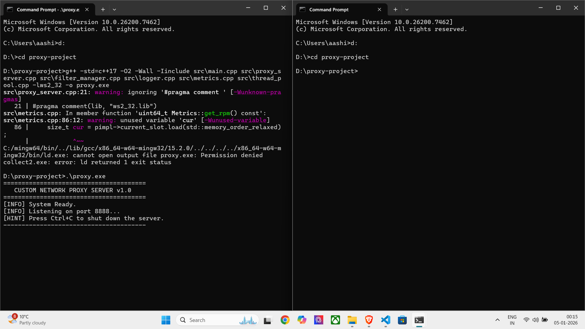
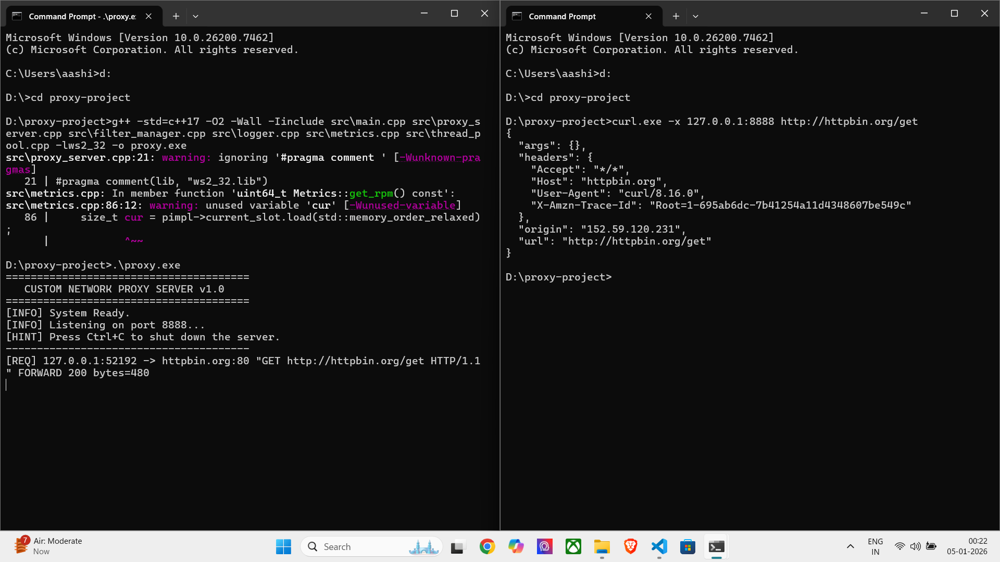
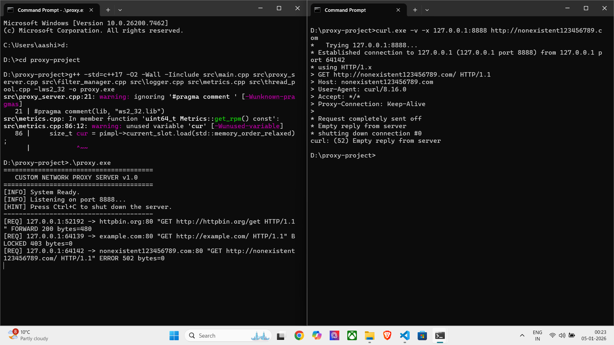
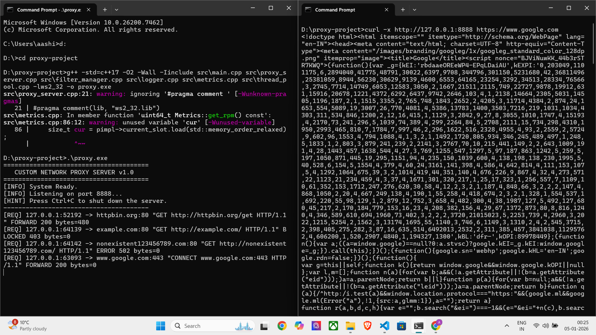
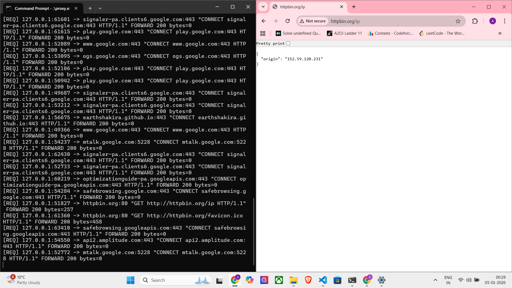

# Screenshots Documentation

This document provides visual documentation of the Proxy Server in action, demonstrating various scenarios and use cases.

## 1. Initialization

**Screenshot:** Server startup and initialization



The proxy server starts up and displays:
- System ready message
- Listening on port 8888
- Configuration loaded
- Ready to accept connections

---

## 2. Valid Connection - HTTP Request

**Command:**
```powershell
curl.exe -x 127.0.0.1:8888 http://httpbin.org/get
```

**Screenshot:** Successful HTTP request through proxy



**Description:**
This demonstrates a successful HTTP GET request through the proxy server. The proxy forwards the request to httpbin.org and returns the JSON response containing request headers and metadata.

**Expected Result:**
- Proxy successfully connects to httpbin.org
- Request is forwarded and response is returned
- Log entry shows successful connection
- Status code: 200 OK

---

## 3. Blocked Site - Forbidden Response

**Command:**
```powershell
curl.exe -x localhost:8888 http://example.com
```

**Screenshot:** Blocked domain returning 403 Forbidden


**Description:**
This demonstrates the domain filtering functionality. Since `example.com` is in the blocked domains list, the proxy returns a `403 Forbidden` response without forwarding the request to the target server.

**Expected Result:**
- Proxy intercepts the request
- FilterManager identifies example.com as blocked
- Returns HTTP 403 Forbidden response
- Request is logged with "BLOCKED" status
- No connection is made to the target server

---

## 4. Invalid Domain - Error Handling

**Command:**
```powershell
curl.exe -v -x 127.0.0.1:8888 http://nonexistent123456789.com
```

**Screenshot:** Error handling for non-existent domain



**Description:**
This demonstrates how the proxy handles DNS resolution failures and connection errors. The verbose flag (`-v`) shows detailed connection information including the error.

**Expected Result:**
- Proxy attempts DNS resolution
- DNS lookup fails (domain doesn't exist)
- Proxy returns appropriate error response (502 Bad Gateway or connection error)
- Error is logged with details
- Client receives error message

---

## 5. HTTPS Tunneling - CONNECT Method

**Command:**
```powershell
curl -x http://127.0.0.1:8888 https://www.google.com
```

**Screenshot:** HTTPS tunneling via CONNECT method



**Description:**
This demonstrates the proxy's HTTPS tunneling capability using the HTTP CONNECT method. The proxy establishes a TCP tunnel between the client and the target server, allowing encrypted HTTPS traffic to pass through.

**Expected Result:**
- Client sends CONNECT request to proxy
- Proxy establishes connection to www.google.com:443
- Proxy sends "200 Connection Established" response
- Bidirectional TCP tunnel is created
- HTTPS traffic flows through the tunnel
- Log entry shows CONNECT method and successful tunneling

---

## 6. Real Browser - Windows Proxy Settings

**Screenshot:** Browser using proxy via Windows system settings



**Description:**
This demonstrates the proxy server being used by a real web browser (Chrome, Edge, Firefox, etc.) configured through Windows system proxy settings. All browser traffic is routed through the proxy server.

**Configuration Steps:**
1. Open Windows Settings → Network & Internet → Proxy
2. Enable "Use a proxy server"
3. Set address: `127.0.0.1`
4. Set port: `8888`
5. Save settings
6. Open browser and navigate to websites

**Expected Result:**
- Browser traffic is routed through the proxy
- All HTTP/HTTPS requests appear in proxy logs
- Blocked domains show 403 Forbidden in browser
- Metrics reflect browser traffic patterns
- Real-time monitoring shows browser requests

---

## Notes

- All screenshots should show the proxy server console output, client terminal output, and relevant log entries
- Screenshots should be placed in the `docs/screenshots/` directory
- File naming convention: `screenshot_<scenario_name>.png`
- Ensure screenshots are clear and readable, showing both command input and output

